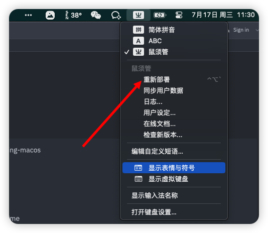

# 小鹤音形配置文件 For MacOS Rime 输入法

## 使用方法

1. [安装Rime输入法](https://rime.im/download/)


2. 复制文件到 ~/Library/Rime 目录下
```bash
# 克隆代码仓库
git clone https://github.com/penjj/xiaoheyinxing-macos

# 备份原有的Rime配置
cp ~/Library/Rime ~/Library/Rime-bak

# 将项目下的小鹤音形配置覆盖到默认配置
mv -f xiaoheyinxing-macos/Rime ~/Library/Rime

```

3. 点击重新部署后即可使用


